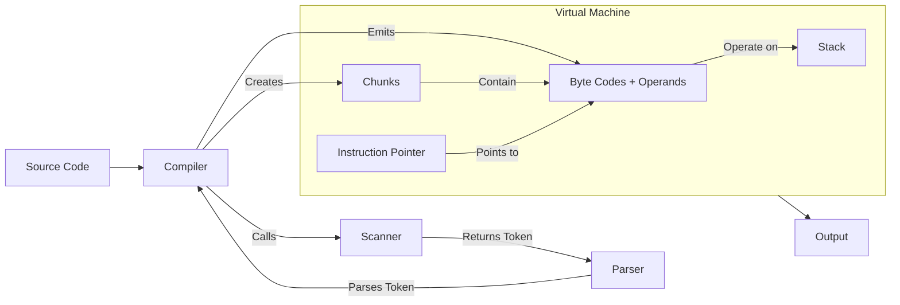

# Clox Architecture

| component            | in c_lox                                                                                                                                | classical definition                                                                                                                                                  |
| -------------------- | --------------------------------------------------------------------------------------------------------------------------------------- | --------------------------------------------------------------------------------------------------------------------------------------------------------------------- |
| scanner              | Scans and tokenizes source.                                                                                                             | Lexical analysis, tokenizes symbols from the source                                                                                                                   |
| parser               | The parsing is actually done inside `compiler.c`. Uses a Pratt style parser. The parser struct stores tokens while they are in process. | Builds a structured representation of the code from the tokens often in the form of an AST. Verifies that code structure is correct and reports errors when it isn't. |
| compiler             | Translates lox source into virtual machine bytecode. Reports parsing errors.                                                            | Translates one language into another, generates code.                                                                                                                 |
| virtual machine (vm) | Runs byte code instructions - decodes and dispatches                                                                                    | Software based emulation of a computer system (stack, instruction pointer). Reports runtime errors.                                                                   |
| chunk                | Storage unit for bytecode instructions, controlled by the instruction pointer and which interact with the stack                         | -                                                                                                                                                                     |

## How it works

In C Lox architecture:

Single pass interpreter

- The `scanner` reads one token at a time. It _lexes_ each word into a meaningful symbol according
  to the grammar.
- The `parser` immediately processes each token as they are created (with lookahead when necessary).
- The `compiler` directly generates bytecode for that token/expression
- The VM executes that bytecode immediately
- Then the process repeats for the next token

## Clearing up "confusing" terminology

#### Q: _What is an interpretted language?_

Often, when people say "interpretted" language, they are referring to ones that run ontop of a
virtual machine or runtime environment.

#### Q: _What is the difference between an interpreter and compiler?_

An `interpretter` scans and executes source code directly. This is exactly what c_lox does. Unlike a
`Compiler`, there is no code generation an application is run, it just executes the code.

## Error handling in Lox

#### Q: _What kinds of errors are there? How are errors handled?_

One of the most important features of a language. How understandable are errors? When should an
application panic vs continue?

Lox has parsing errors (reported by the compiler) and runtime errors (reported by the vm).
Generally, lox tries to panic as little as possible and report errors without panicking.
